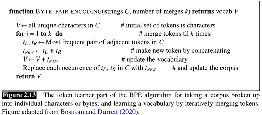
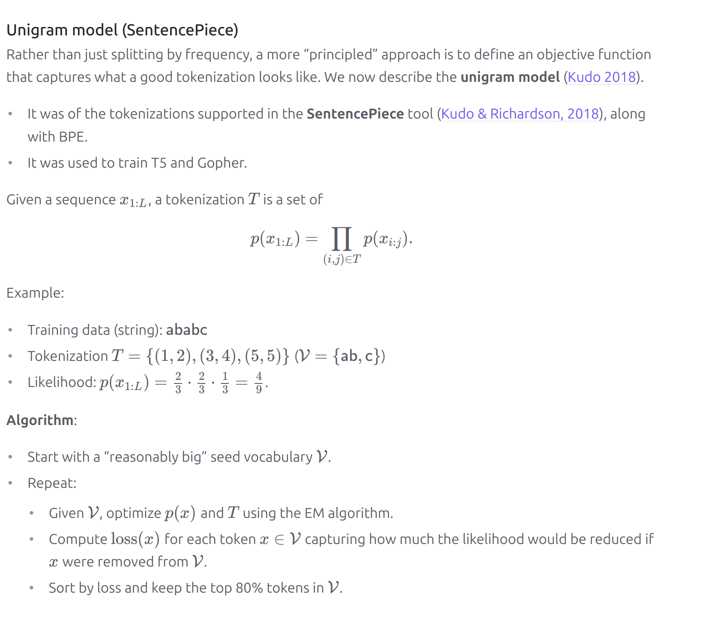
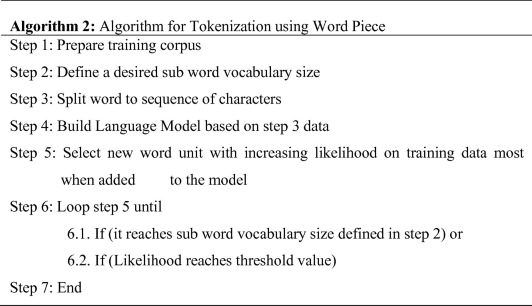

# High level explanation
unigram_tokenizer.json represents the high level confuguration of the unigram tokenizer used for NLP tasks.
The model section represents the unigram model and the vocab section resperesents the logarithmic probabilities of appearing in the text.
Tokens are also specified: CLS = during input of classification tasks, SEP = different segments within the text, 
PAD = required for batching as it aligns sequences to same lengths, UNK = basically handles any unknown words i.e not within its vocab,
MASK =  its basically used in masked language models in which the model predicts the hidden/missing word
The logarithmic probabilities (the numbers represented under each token) refers to the probability of the token being present in the corpus.
The higher the number i.e closer to 0, the more likely the token is to appear in the corpus, whereas if the number is further away from 0, then the probability is lower. For example a token with log-probability of -2.8~ has a higher probability of appearing in the corpus than a token with log-probability of -5.7~.

# Tokenizers used and algorithms behind them
All the tokenizers used here are from the sample pipeline showcases at (https://huggingface.co/docs/tokenizers/pipeline). These include
1. BPE (Byte-Pair Encoding) Tokenizer
Purpose: BPE tokenization breaks down words into smaller subwords and can thus help in handling rare words by breaking them into known subword segments.
Working: BPE iteratively merges the most frequent pairs of characters or subwords in the corpus to build a vocabulary of subword units. (mentioned in the code)
Algorithm: 

Application: Its used where efficient handling of rare or unknown words is necessary like machine translation and language modeling.

2. Unigram Tokenizer
Purpose: The Unigram model tokenizes by choosing subwords with the highest likelihood as opposed to iteratively merging pairs like BPE.
Working: Unigram tokenization trains a probability model over a fixed vocabulary keeping subwords with high probability and discarding others. During tokenization the tokenizer picks the highest probability segmentation for each word. (the log-probabilities as seen in code)
Algorithm:

Application: Its commonly used in NLP systems that require a balance between handling subwords and whole words.

3. WordLevel Tokenizer
Purpose: This tokenizer is based on whole words in the vocabulary. If a word isn't in the vocabulary, it is replaced with a special [UNK] token. (Here UNK stands for unknown)
Working: WordLevel tokenization matches each word from the text against the vocabulary directly and doesn’t break down words further. If a word doesn’t exist in the vocabulary, it assigns the [UNK] token. (This can be seen in the unigram_tokenizer.json file)
Algorithm:
Split each sequence S into words based on whitespaces S=[w1, w2, w3, ... wn]. For each word w count occurences in the corpus to get
f(w). Sort words by frequency and select the top N words to form the Vocab V. If any word not in V then assign it as special token UNK.
Application: Useful in applications with closed vocabularies where out-of-vocabulary words can be substituted with [UNK] like for e.g classification tasks with a set of known words.

4. WordPiece Tokenizer
Purpose: WordPiece tokenization is a hybrid approach that segments words into smaller known subwords thus helping the model understand both common and rare words more effectively.
Working: It starts with individual characters as tokens then iteratively adds frequent subwords to the vocabulary until a specified vocabulary size is reached. Its kind of similar to BPE but differs at times in how subwords are selected.
Algorithm:

Application: It is used where a flexible vocabulary helps handle diverse linguistic patterns.

# References
The best way to learn about the algorithms mentioned above is from (https://huggingface.co/learn/nlp-course/en/chapter6/1?fw=pt) and 
(https://huggingface.co/docs/tokenizers/index)

# NLP concepts
Tokenization is closely associated with NLP and is used for NLP tasks. This includes but is not limited to text summarisation, sentiment analysis as well as NER (Named entity recognition).